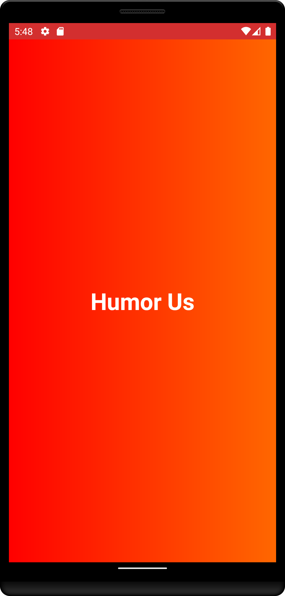
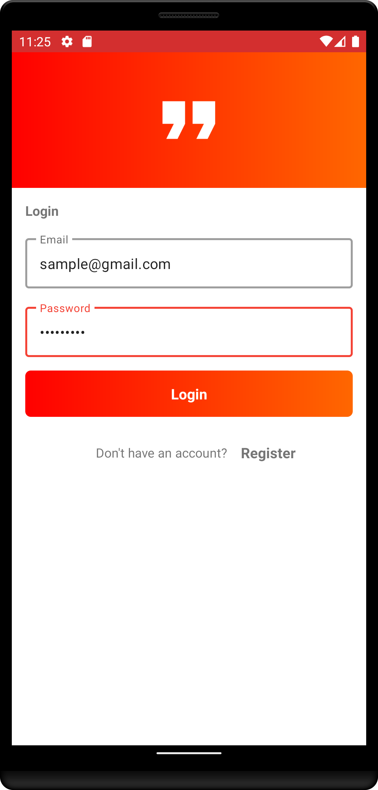
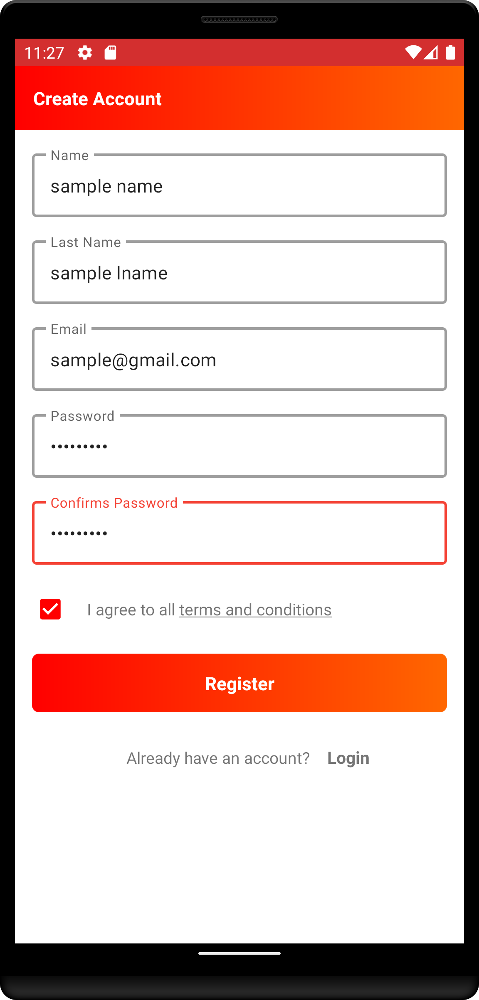
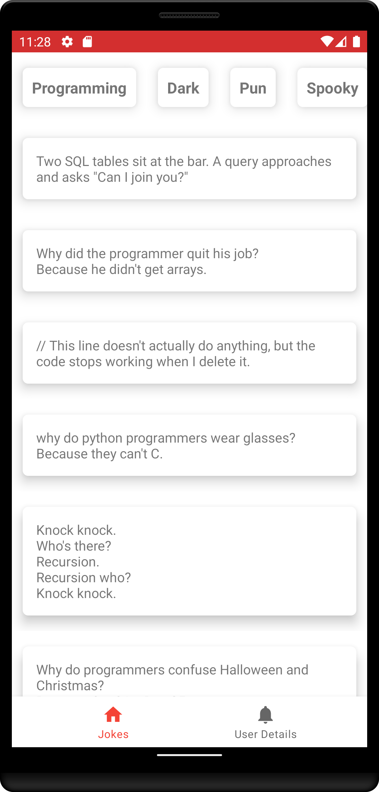
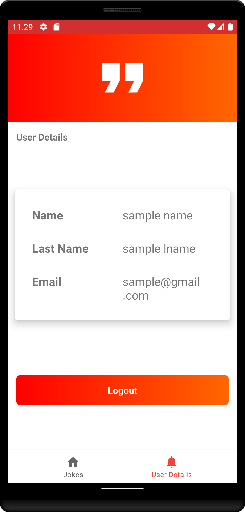

# AndroidMVVMApp 

## Description

A sample application which implements android MVVM Architecture. The sample application shows jokes from various categories.
It fetches data from Jokes api using retrofit api. It uses firebase to login and register user.
It uploads user details using firebase storage. It uses various APIs like retrofit, material design, room database, coroutines and firebase.

## Application Screenshots

* Splash Screen:
  -

   
   

* The user will be presented with the login screen which will ask for login credentials to use the application.

  - **Login Screen:** 
  

  
  

  - **Register Screen:**
  

  
  

* Following is the home screen for the application. It contains bottom navigation view which has two options Jokes and User Details to choose from
  By default jokes options is choosen but user can also choose 'User details' option to see user details.
  
  - **Jokes Screen:**
  

  
  

  
  - **User Details Screen:**
  

  
  

  
## Code Structure

The sample application is created mainly by keeping Clean Code MVVM Architecture into our point of vision.

Different layers of the project: 

- **Data layer:** The Room persistence library provides an abstraction layer over SQLite to allow fluent database access while harnessing the full power of SQLite. Defining the Room entity, setting up the DAO Interface and building the Database Builder is done in this layer.

- **Network layer:** Network layer provides network implementation of the application. It fetches jokes from remote database using retrofit api. Data will be stored in local database via room persistence library. Retrofit api also implements network interceptor to check connection status.

- **UI layer:** The UI layer provides the UI implementation of the application. This layer internally implements MVVM (Model-View-ViewModel) architecture. It contains various fragments/activities, viewmodel and controller for the data.

## Package Structure

     com.example.androidMVVMApp        # Root Package
      .
      ├── data                         # For data handling.
      │   ├── db                       # Local Persistence Database. Room (SQLite) database.
      │   ├── model                    # Model Classes.
      |   ├── preference               # Shared Preference.
      │   └── repository               # Defining the JokesRepository, UserDetailsRepository and UserRepository classes which provide connection 
      │ 			                           to LocalDataSource and RemoteDataSource classes.
      |
      ├── network                      # For handling remote database.
      │   ├── responses                # Jokes response class
      │    
      ├── ui                           # Implements UI functionalities.
      │   ├── auth                     # Add Login Activity, Register Activity(to login or register user) related View Model and View Model Factory class.
      |   ├── controller               # Contains various recycler view adapters.
      │   ├── jokes                    # Add Jokes Fragment(shows jokes) related View Model and View Model Factory class.
      │   ├── userDetails              # Add UserDetails Fragment(shows jokes) related View Model and View Model Factory class.
      │   ├── UserDetailsActivity      # User Details Activity(to show JokesFragment and UserDetailsFragment).
      |
      └── utils                        # Utility Classes / Kotlin extensions
      
## Technologies and Libraries

- [Kotlin](https://kotlinlang.org/) - Official programming language for Android development.
- [Coroutines](https://kotlinlang.org/docs/reference/coroutines-overview.html) - For working with asynchronous threading related task.
- [Android Architecture Components](https://developer.android.com/topic/libraries/architecture) - Collection of libraries that help you design robust, testable, and maintainable apps. Thus they help us to separate business logic apart from the UI logic and helps us in designing proper architecture.
  - [LiveData](https://developer.android.com/topic/libraries/architecture/livedata) - Data objects that notify views when the underlying database changes.
  - [ViewModel](https://developer.android.com/topic/libraries/architecture/viewmodel) - Stores UI-related data that isn't destroyed on configuration changes. 
  - [DataBinding](https://developer.android.com/topic/libraries/data-binding) - The Data Binding Library is a support library that allows you to bind UI components in your layouts to data sources in your app using a declarative format rather than programmatically.
  - [Room](https://developer.android.com/topic/libraries/architecture/room) - The Room persistence library provides an abstraction layer over SQLite to allow fluent database access while harnessing the full power of SQLite.
- [Firebase Authentication](https://firebase.google.com/docs/auth) - Firebase Authentication provides backend services, easy-to-use SDKs, and ready-made UI libraries to authenticate users to your app. It supports authentication using passwords, phone numbers, popular federated identity providers like Google, Facebook and Twitter, and more.
- [Firebase Cloud Storage](https://firebase.google.com/docs/firestore) - Cloud Firestore is a flexible, scalable database for mobile, web, and server development from Firebase and Google Cloud. Like Firebase Realtime Database, it keeps your data in sync across client apps through realtime listeners and offers offline support for mobile and 
                                                                         web so you can build responsive apps that work regardless of network latency or Internet connectivity. Cloud Firestore also offers seamless integration with other Firebase and Google Cloud products, including Cloud Functions.
 

## Built With

* Android Studio

## Author
* <a href="https://github.com/aikansh2001yadav"> **Aikansh Yadav** </a>
                                                                         

  
  
 
